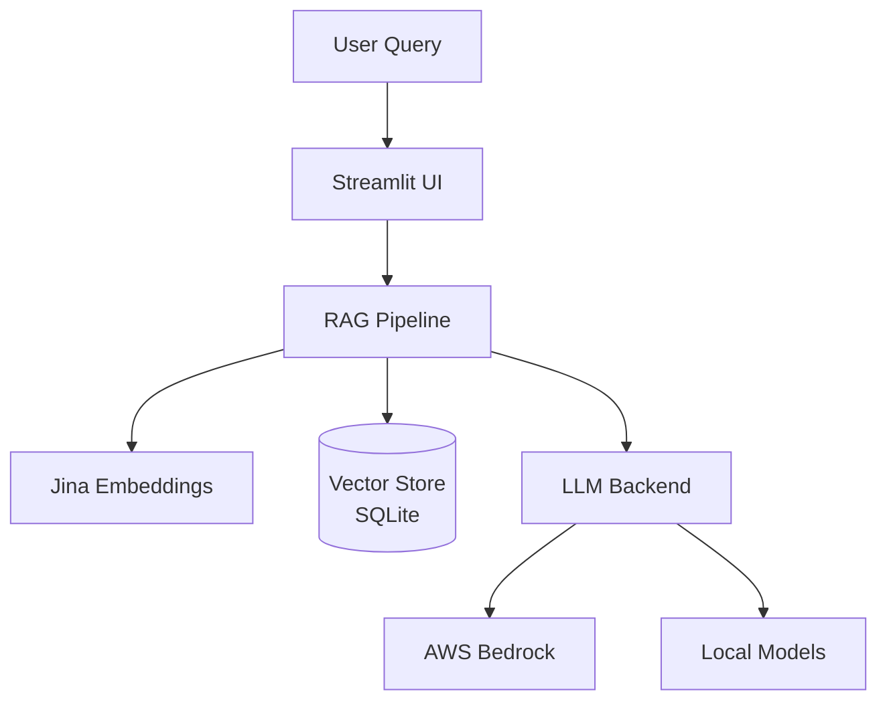

# WattBot RAG User Interface

A Streamlit-based chat interface for the KohakuRAG pipeline, enabling interactive Q&A over the WattBot research corpus on sustainable AI.

## Project Context

This repository supports the Research Cyberinfrastructure Exploration initiative at UW-Madison. The goal is to build a long-running chatbot that answers questions about the environmental impacts of AI using a curated corpus of energy and sustainability research papers.

The project uses [KohakuRAG](https://github.com/KohakuBlueleaf/KohakuRAG), the top-ranked solution from the 2025 WattBot Challenge, as the core retrieval engine. This repository focuses on:

1. Building a user-facing Streamlit interface
2. Deploying the system on AWS using Bedrock for LLM inference
3. Comparing managed cloud deployment against self-hosted alternatives

## Architecture

The system follows a standard RAG (Retrieval-Augmented Generation) architecture:



### Deployment Options

| Approach | LLM Backend | Use Case |
|----------|-------------|----------|
| AWS Bedrock | Managed foundation models via API | Production, on-demand usage |
| Local | Small models under 1B params | Development, on-prem deployment |

## Repository Structure

```
.
├── docs/
│   └── bedrock-integration-proposal.md   # AWS Bedrock design document
├── src/                                  # Application source code
├── configs/                              # Pipeline configuration
├── .env.example                          # Environment template
└── README.md
```

## Development Branches

- **main**: Stable releases and documentation
- **bedrock**: AWS Bedrock integration (Nils)
- **local**: Local/on-prem LLM support (Blaise)

## Related Resources

- [KohakuRAG](https://github.com/KohakuBlueleaf/KohakuRAG) - Core RAG engine
- [WattBot 2025 Competition](https://www.kaggle.com/competitions/WattBot2025/overview) - Original challenge
- [AWS Bedrock Documentation](https://docs.aws.amazon.com/bedrock/) - Managed LLM service

## Team

| Name | Role |
|------|------|
| Chris | Research Supervisor |
| Blaise | Local deployment |
| Nils | AWS Bedrock integration |

## License

Research project under UW-Madison Research Cyberinfrastructure.
