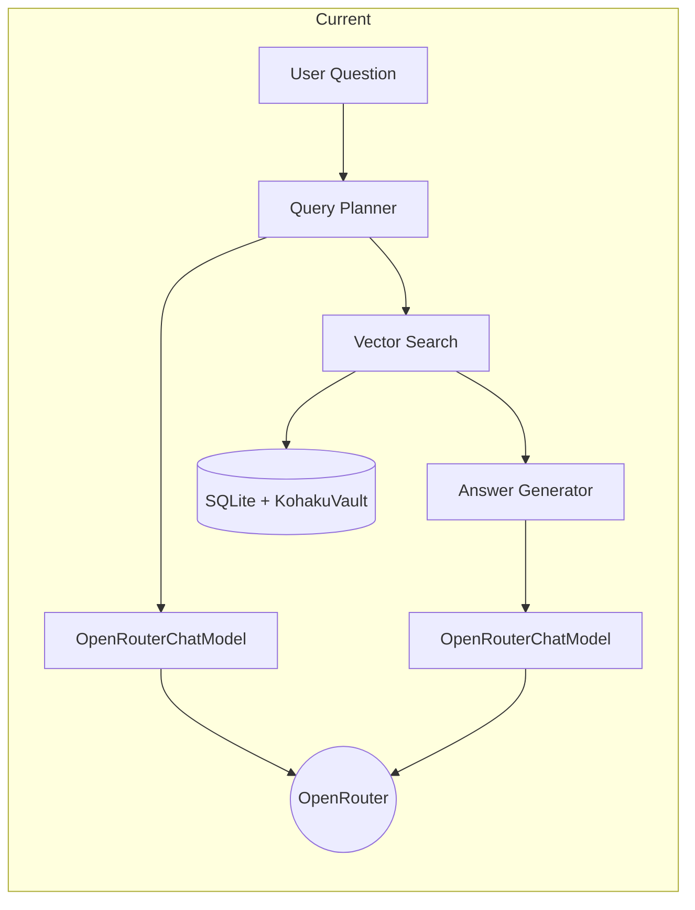
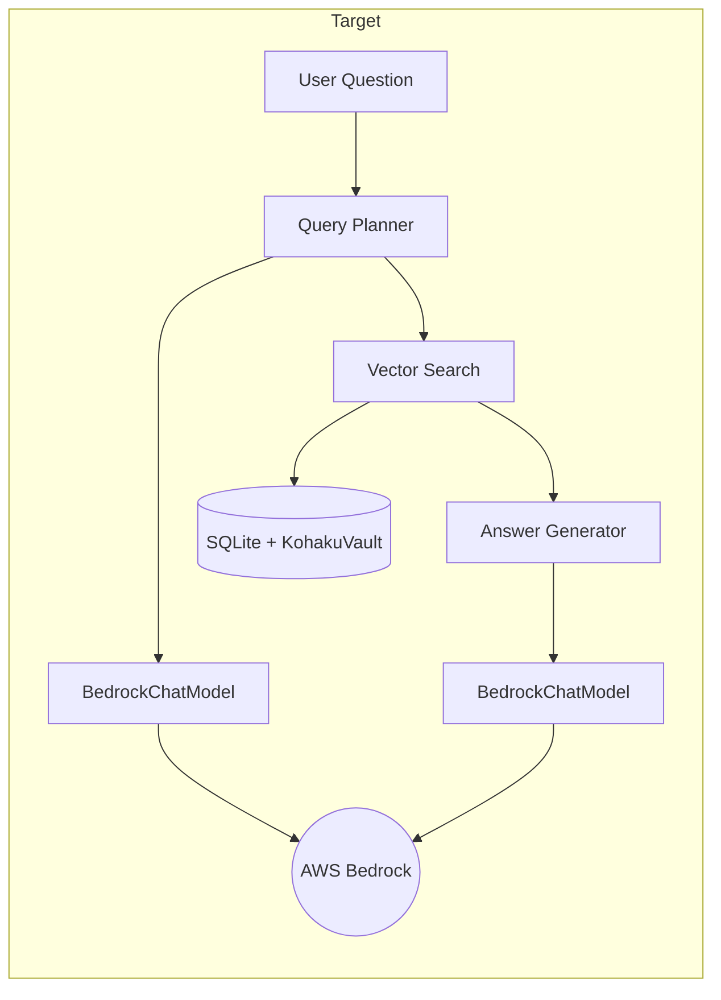

# AWS Bedrock Integration Proposal

**Author**: Nils  
**Date**: January 14, 2026  
**Last Updated**: January 16, 2026  
**Status**: Approved - Ready for Implementation  
**Branch**: `bedrock`

---

## Overview

This document outlines my plan for integrating AWS Bedrock into the KohakuRAG pipeline. The goal is to replace OpenRouter API calls with Bedrock's managed foundation models.

**Update (1/16)**: Chris reviewed this proposal and confirmed the approach looks good. His answers to my questions are included below.

---

## My Understanding of KohakuRAG

Based on reading through the research paper and the codebase, here's what I understand about how the system works:

### Document Processing

KohakuRAG uses a **4-level hierarchical structure** for documents:

```
Document
  └── Section (based on headings)
        └── Paragraph
              └── Sentence
```

Each level gets embedded. Sentences are embedded directly using Jina, and parent nodes get their embeddings by averaging their children's embeddings. This "bottom-up aggregation" is a key part of the design.

*Chris confirmed this matches what's described in the paper.*

### The RAG Pipeline

When a user asks a question, here's what happens:

1. **Query Planning**: An LLM takes the question and generates multiple search queries
2. **Retrieval**: Each query searches the vector store and returns top-k results
3. **Deduplication/Reranking**: Results are deduplicated and ranked by frequency or score
4. **Context Expansion**: Retrieved sentences are expanded to include their parent paragraphs
5. **Answer Generation**: The LLM generates a structured answer based on the context

*Chris confirmed the 3-phase flow (planning, retrieval, generation) matches the paper.*

### Where LLMs Are Used

LLMs are called in two places:

1. **Query Planner** (`LLMQueryPlanner` in `wattbot_answer.py`)
2. **Answer Generation** (`RAGPipeline.run_qa`)

Both currently use `OpenRouterChatModel` from `src/kohakurag/llm.py`.

---

## Architecture

### Current (OpenRouter)



### Target (AWS Bedrock)



---

## Files to Modify

1. **`src/kohakurag/llm.py`** - Add `BedrockChatModel` class
2. **`scripts/wattbot_answer.py`** - Add `"bedrock"` as an `llm_provider` option
3. **`pyproject.toml`** - Add `boto3` dependency

---

## Questions and Answers

### Model Access

**Q**: How do I check which models are enabled in Bedrock?

**A** (Chris): Most models should now be available by default in Bedrock. If you hit any access errors (model not enabled / permission denied), let me know and we'll sort out access.

### Region

**Q**: Which region should I use?

**A** (Chris): Default to `us-east-2`. That region should have most of the Bedrock models available.

### Model Selection

**Q**: Which model should I try first?

**A** (Chris): Start small/cheap for the prototype, get the end-to-end plumbing working, then swap in "better"/larger models once everything is stable. The smallest OpenAI or Anthropic models are good starting points.

### Cost Monitoring

**A** (Chris): Check the Cost Explorer early/regularly to confirm you're tagging/attributing spend the way you expect. Expect up to ~24 hours lag sometimes before costs show up.

---

## Additional Notes from Chris

### Vector Store vs S3

Chris mentioned: "One thing I'm less certain about is whether we need a vector store or not for this. With the size of our corpus, we can probably get away with just storing the data in an S3 bucket. However, I'm game to explore the vector store option. That option is more production-level, anyways."

For now, I'll stick with the existing SQLite + KohakuVault approach since it's already implemented and works. We can revisit S3 later if needed.

### Ensemble Setup

Chris mentioned: "Another tricky piece to research is going to be how to elegantly use an ensemble model setup in Bedrock. I think it should be possible to setup concurrent calls to multiple models, but I haven't done it before."

His recommendation: Start with an ensemble of N=1 or N=2 and scale up later.

### Future Migration

At some point the code may move to GitLab (where UW-Madison's longer-living code lives), but that's an easy migration for later.

---

## Implementation Plan

### Phase 1: AWS Setup (Current)

- [x] Proposal reviewed by Chris
- [ ] Log into AWS Console via SSO
- [ ] Verify Bedrock access in `us-east-2`
- [ ] Install AWS CLI and configure SSO profile locally
- [ ] Test with a simple boto3 script

### Phase 2: Prototype

- [ ] Write standalone script to call Bedrock
- [ ] Figure out request/response format for Anthropic models
- [ ] Test with a small, cheap model first

### Phase 3: Integration

- [ ] Add `BedrockChatModel` to `llm.py`
- [ ] Update `wattbot_answer.py` to support `bedrock` provider
- [ ] Test with a few WattBot questions
- [ ] Check Cost Explorer after 24 hours

### Phase 4: Documentation and PR

- [ ] Update README with Bedrock setup instructions
- [ ] Document any issues encountered
- [ ] Create PR for review

---

## Resources

- [Generative AI Applications with Amazon Bedrock](https://www.coursera.org/learn/generative-ai-applications-amazon-bedrock) - Coursera course Chris recommended
- [AWS Bedrock Documentation](https://docs.aws.amazon.com/bedrock/)

---

## Changelog

- **1/16/2026**: Added Chris's feedback and answers, updated status to "Approved"
- **1/14/2026**: Initial proposal

---

- Nils
