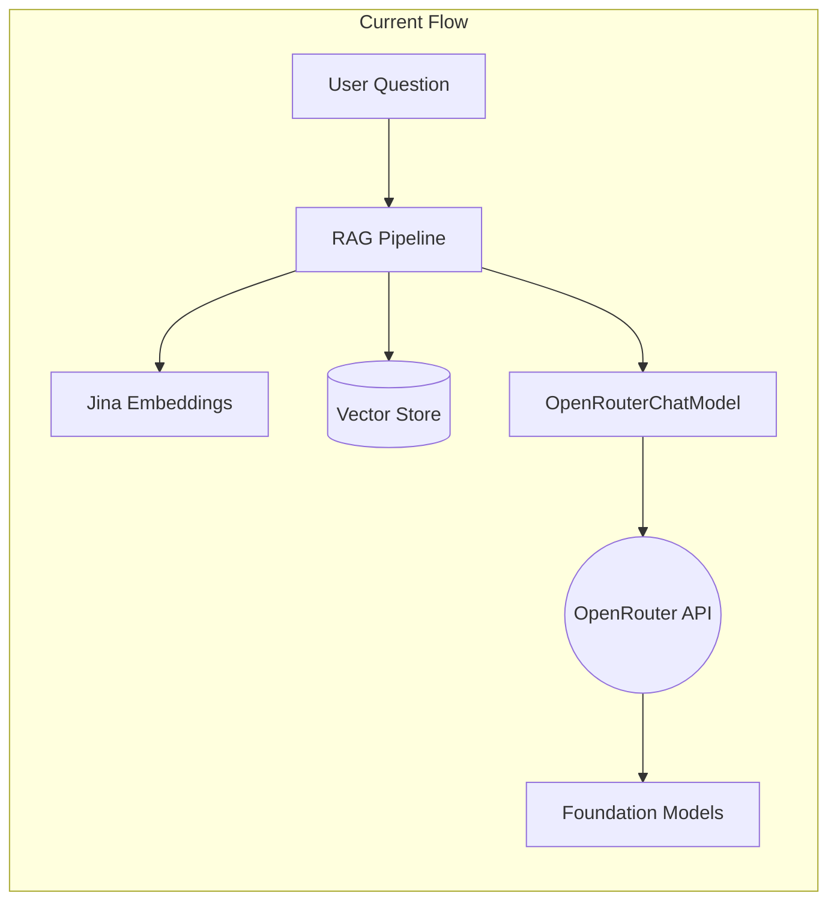
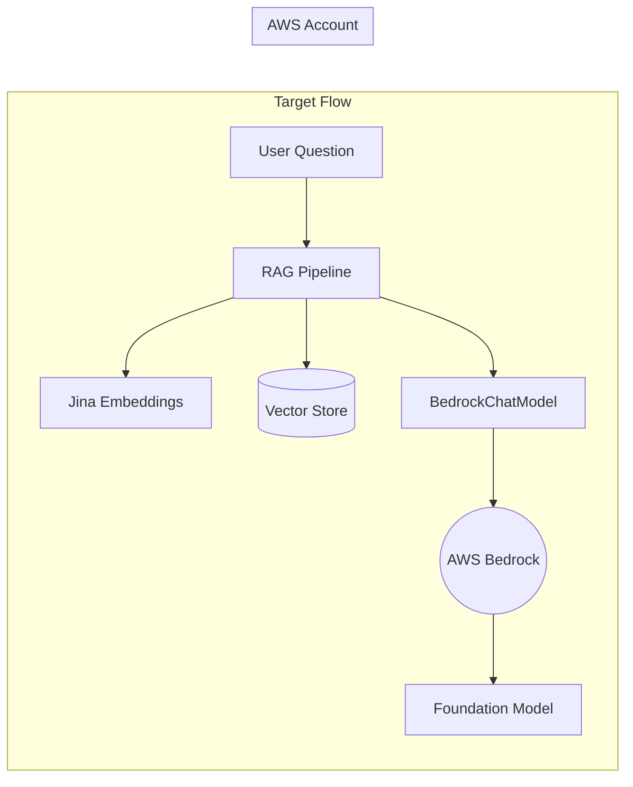
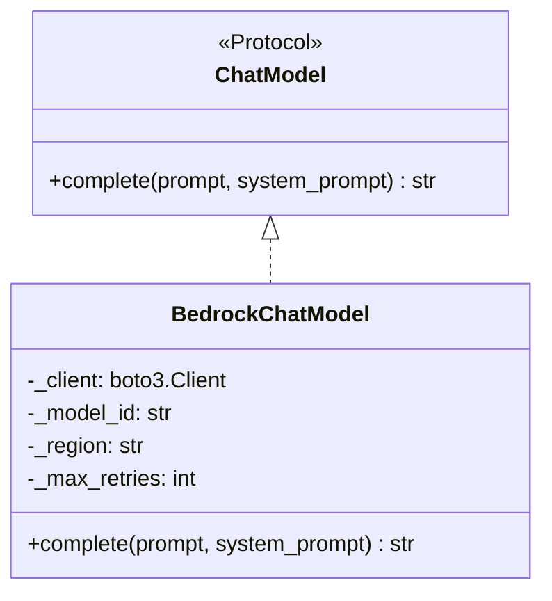
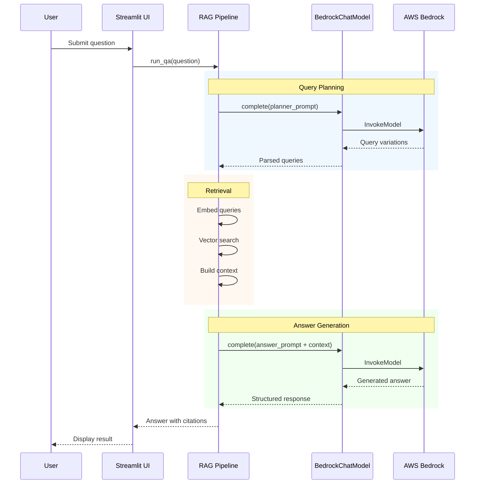

# AWS Bedrock Integration Proposal

**Author**: Nils  
**Date**: January 14, 2026  
**Status**: Draft - Awaiting Review  
**Branch**: `bedrock`

---

## Overview

This document outlines my plan for integrating AWS Bedrock into the KohakuRAG pipeline. The goal is to replace OpenRouter API calls with Bedrock's managed foundation models, giving us on-demand LLM access within the AWS ecosystem.

I'm writing this before starting implementation to get feedback on the approach.

---

## Current Architecture

The KohakuRAG pipeline currently uses OpenRouter to access LLMs. OpenRouter is a unified API that routes requests to different model providers.



## Target Architecture

We want to replace OpenRouter with AWS Bedrock so we:

- Stay within the AWS ecosystem
- Pay only when we use it (no idle costs)
- Have better control over access and billing



---

## Files to Modify

I've identified three files in the KohakuRAG codebase that need changes:

### 1. `src/kohakurag/llm.py`

This is where all the LLM integrations live. Currently has:

- `OpenAIChatModel` - for direct OpenAI API
- `OpenRouterChatModel` - for OpenRouter

I'll add a new `BedrockChatModel` class that uses `boto3` to call Bedrock.

### 2. `scripts/wattbot_answer.py`

This is the main script that runs the RAG pipeline. It has a `create_chat_model()` factory function that creates the LLM client based on config.

I'll add `"bedrock"` as a valid `llm_provider` option.

### 3. `pyproject.toml`

I'll add `boto3` as a dependency.

---

## BedrockChatModel Design

The new class will implement the same `ChatModel` protocol as the existing classes.



Key implementation details:

- Uses `boto3.client('bedrock-runtime')` to make API calls
- Formats messages according to Bedrock's expected payload structure
- Handles rate limiting with exponential backoff
- Region defaults to `us-east-2` based on our AWS account

---

## Request Flow

This diagram shows what happens when a user asks a question:



---

## Configuration

The provider can be selected via config:

```python
# LLM Provider Selection
llm_provider = "bedrock"  # Options: "openai", "openrouter", "bedrock"

# Bedrock-specific settings
bedrock_model_id = "..."  # Model ID from Bedrock console
bedrock_region = "us-east-2"
```

---

## Questions for Chris

Before I start coding, I'd like your input on:

1. **Model Selection**: Which foundation model should we use? There's a tradeoff between cost and quality. Should we use a faster/cheaper model for query planning and a higher-quality one for answer generation?

2. **Region**: The AWS account appears to be in `us-east-2`. Should I hardcode this or make it configurable?

3. **Model Access**: When I log into the AWS console, should I verify which models are enabled in Bedrock? Or do you already know what's available?

4. **Error Handling**: If Bedrock fails (rate limits, outage), should I just show an error, or implement a fallback to OpenRouter?

---

## Implementation Plan

### Phase 1: AWS Setup

- Log into AWS Console via SSO
- Check Bedrock Model Access settings
- Install AWS CLI and configure SSO profile
- Verify credentials work with `aws sts get-caller-identity`

### Phase 2: Development Setup

- Add `boto3` to dependencies
- Create `.env.example` with AWS config
- Test basic Bedrock call with standalone script

### Phase 3: Integration

- Implement `BedrockChatModel` class
- Update factory function to support `bedrock` provider
- Test with WattBot questions

### Phase 4: Documentation

- Update README with setup instructions
- Create PR for review

---

## What I Need

1. **AWS Access** - Already have it, thank you
2. **Model Access Confirmation** - Are foundation models enabled in Bedrock?
3. **Feedback on this document** - Any concerns with the approach?
4. **Answers to the questions above**

---

Let me know if anything needs clarification or if the approach looks off.

— Nils
