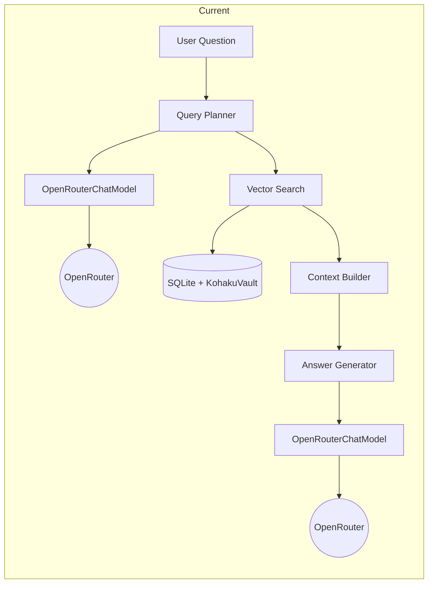
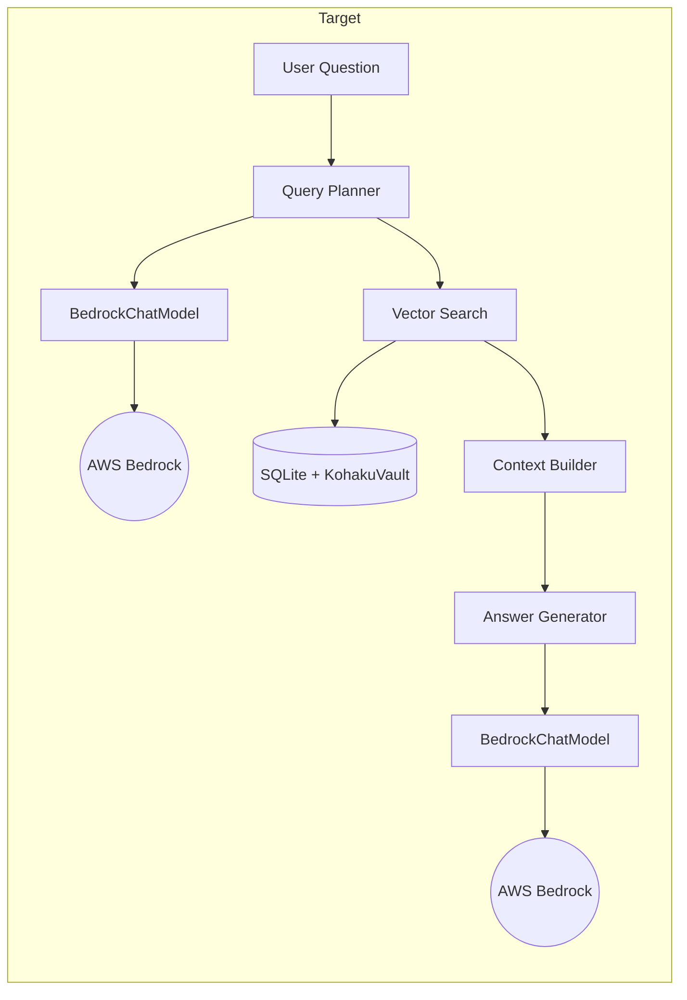
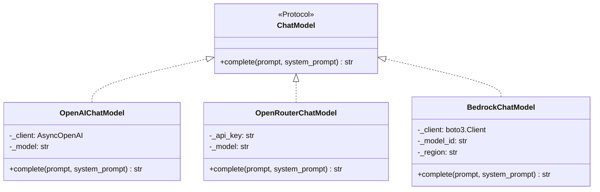
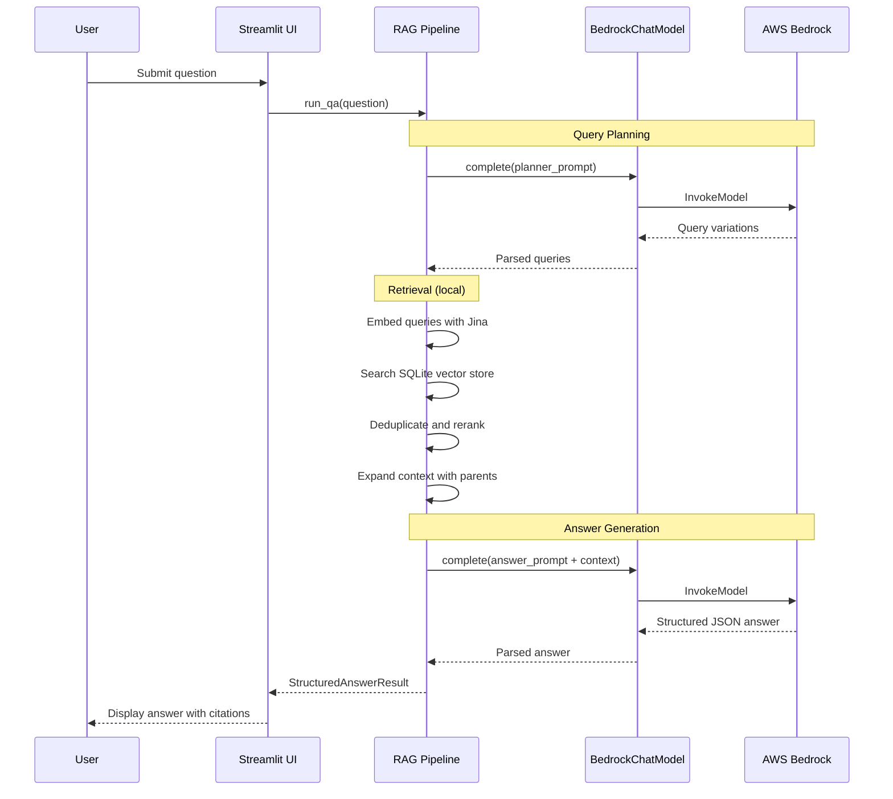

# AWS Bedrock Integration Proposal

**Author**: Nils  
**Date**: January 14, 2026  
**Status**: Draft, Awaiting Review  
**Branch**: `bedrock`

---

## Overview

This document outlines my plan for integrating AWS Bedrock into the KohakuRAG pipeline. I want to make sure I understand the system correctly before writing any code, so I'm documenting my approach here for feedback.

The goal is to replace OpenRouter API calls with Bedrock's managed foundation models. This keeps us within the AWS ecosystem and means we only pay when we're actually using it.

---

## My Understanding of KohakuRAG

Based on reading through the research paper and the codebase, here's what I understand about how the system works:

### Document Processing

KohakuRAG uses a **4-level hierarchical structure** for documents:

```
Document
  └── Section (based on headings)
        └── Paragraph
              └── Sentence
```

Each level gets embedded. Sentences are embedded directly using Jina, and parent nodes get their embeddings by averaging their children's embeddings. This "bottom-up aggregation" is a key part of the design.

### The RAG Pipeline

When a user asks a question, here's what happens:

1. **Query Planning**: An LLM takes the question and generates multiple search queries (the original plus some variations that highlight key entities)
2. **Retrieval**: Each query searches the vector store and returns top-k results
3. **Deduplication/Reranking**: Results are deduplicated and ranked by frequency or score
4. **Context Expansion**: Retrieved sentences are expanded to include their parent paragraphs for context
5. **Answer Generation**: The LLM generates a structured answer based on the retrieved context

### Where LLMs Are Used

Looking at the code, LLMs are called in two places:

1. **Query Planner** (`LLMQueryPlanner` in `wattbot_answer.py`): Takes the user question and generates additional retrieval queries
2. **Answer Generation** (`RAGPipeline.run_qa`): Takes the context and generates the final answer

Both currently use `OpenRouterChatModel` from `src/kohakurag/llm.py`.

---

## Current Architecture



## Target Architecture



---

## What I Need to Change

### 1. `src/kohakurag/llm.py`

This file defines the LLM integrations. Currently has:

- `OpenAIChatModel`: Uses the OpenAI SDK directly
- `OpenRouterChatModel`: Uses the OpenRouter SDK

I need to add `BedrockChatModel` that:

- Uses `boto3` to call the Bedrock Runtime API
- Implements the same `ChatModel` protocol (just needs a `complete()` method)
- Handles the message format that Bedrock expects

One thing I'm not 100% sure about: the existing models are async (using `async def complete`), but boto3 is synchronous by default. I'll probably need to wrap the boto3 calls in `asyncio.to_thread()` to keep them non-blocking.

### 2. `scripts/wattbot_answer.py`

This script has a `create_chat_model()` factory function that creates the LLM client based on config. Currently supports `"openai"` and `"openrouter"`.

I need to add a `"bedrock"` option here.

### 3. `pyproject.toml`

Add `boto3` as a dependency.

---

## BedrockChatModel Design



Key things I need to figure out:

- What model ID format does Bedrock use?
- How do I format the request body for different model providers on Bedrock?
- How should I handle rate limiting? Bedrock probably has different limits than OpenRouter.

---

## Request Flow



---

## Questions I Have

### For Chris

1. **Model access**: When I log into the AWS console, how do I check which models are enabled in Bedrock? Do I need to request access to specific models, or is that already set up?

2. **Region**: The AWS account seems to be in `us-east-2` based on the console URL. Is that where I should be making Bedrock calls from?

3. **Which model should I use?**: Bedrock has models from different providers (Anthropic, Amazon, Meta, etc.). Any preference on which one to try first?

### Things I Need to Research

1. How does Bedrock's request/response format work? Is it the same for all models or does each provider have a different format?

2. What's the rate limiting like on Bedrock? Do I need to implement backoff like the existing OpenRouter code does?

3. How do I authenticate? I know we're using SSO, but I need to figure out how that works with boto3.

---

## Implementation Plan

### Phase 1: AWS Setup

Before writing any code, I want to make sure I can actually call Bedrock:

- Log into AWS Console via SSO
- Find Bedrock in the console and check model access
- Install AWS CLI and configure SSO profile locally
- Test with a simple boto3 script to verify credentials work

### Phase 2: Prototype

Write a standalone Python script that:

- Uses boto3 to call Bedrock
- Sends a simple prompt and gets a response
- Figures out the request/response format

### Phase 3: Integration

Once I have a working prototype:

- Add `BedrockChatModel` to `llm.py`
- Update `wattbot_answer.py` to support the `bedrock` provider
- Test with a few WattBot questions

### Phase 4: Documentation

- Update the README with Bedrock setup instructions
- Document any gotchas I run into
- Create PR for review

---

## Things I'm Uncertain About

I want to be upfront about what I don't fully understand yet:

1. **Async handling**: The existing code is async, but boto3 is sync. I think I can use `asyncio.to_thread()` but I haven't tested this.

2. **Error handling**: The OpenRouter code has pretty sophisticated retry logic. I need to figure out what errors Bedrock returns and how to handle them.

3. **Cost**: I don't have a good sense of how much Bedrock costs compared to OpenRouter. Might be worth doing some calculations before we run big experiments.

4. **Multi-modal**: The paper mentions support for images via Jina v4. I'm focusing on text-only first, but I'm not sure if that affects the Bedrock integration at all.

---

## Next Steps

Waiting on:

- [ ] Chris to confirm model access in Bedrock
- [ ] Feedback on this proposal
- [ ] Answers to my questions above

Once I hear back, I'll start with Phase 1 (AWS setup verification).

---

Let me know if I'm missing anything or if the approach looks wrong.

- Nils
