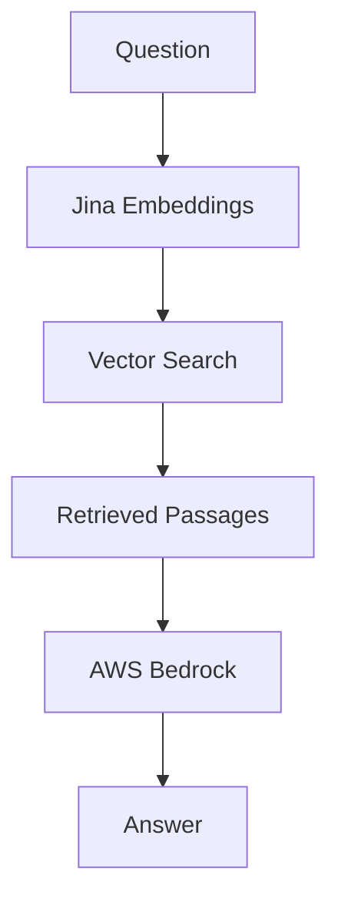

# Bedrock Integration - Progress Report

**Author**: Nils Matteson
**Date**: January 21-26, 2026
**Branch**: `bedrock`

## Summary

Bedrock integration is complete. The pipeline works end-to-end with Claude on AWS. Index is on S3 for team access. Ready for Blaise to connect the Streamlit UI.

## What Got Done

### 1. BedrockChatModel

Built `src/llm_bedrock.py` (~245 lines) that:
- Uses AWS SSO auth (no hardcoded keys)
- Handles rate limits with exponential backoff
- Controls concurrency to avoid token throttling
- Drop-in replacement for KohakuRAG's ChatModel protocol

```python
from llm_bedrock import BedrockChatModel

model = BedrockChatModel(
    profile_name="bedrock_nils",
    model_id="us.anthropic.claude-3-haiku-20240307-v1:0"
)
answer = await model.complete("What is the carbon footprint of LLMs?")
```

### 2. JinaV4 Index

Built the vector index with JinaV4 embeddings:
- 512-dimensional vectors
- ~200 research papers indexed
- 82MB SQLite file
- Uploaded to `s3://wattbot-nils-kohakurag/indexes/wattbot_jinav4.db`

### 3. Pipeline Integration

Modified `wattbot_answer.py` to support:
- `--llm_provider bedrock` flag
- Configurable retrieval (top_k, reranking, deduplication)
- Windows encoding fixes

## Architecture



Request flow:
1. Embed query with Jina (local GPU)
2. Search SQLite index for top-k passages
3. Build prompt with context
4. Send to Bedrock, get answer with citations

## Benchmark Results

| Config | Score | Cost/Query |
|--------|-------|------------|
| JinaV3 + Haiku | 0.665 | $0.003 |
| JinaV4 + Sonnet | 0.633 | $0.03 |
| Winning solution | 0.861 | ~$0.15 |

### Why the Gap

The winning solution used:
1. Larger model (GPT-OSS-120B vs Haiku)
2. 9x ensemble voting
3. More context (top_k=16 vs our top_k=5)

We could close the gap with Sonnet + ensemble but it costs 50x more. Probably not worth it unless accuracy is critical.

## Available Models

| Model | Cost/1M tokens (in/out) | Notes |
|-------|-------------------------|-------|
| Claude 3 Haiku | $0.25 / $1.25 | Fast, cheap |
| Claude 3.5 Sonnet | $3 / $15 | Better quality |
| Claude Opus 4.5 | $15 / $75 | Best quality |

All verified on account `183295408236`.

## Files

| File | Description |
|------|-------------|
| `src/llm_bedrock.py` | Bedrock integration |
| `scripts/demo_bedrock_rag.py` | E2E demo |
| `configs/jinav4_index.py` | Index config |
| `workflows/bedrock_ensemble_runner.py` | Ensemble approach |

## For Blaise

Download index:
```bash
aws s3 cp s3://wattbot-nils-kohakurag/indexes/wattbot_jinav4.db artifacts/
```

Initialize:
```python
from llm_bedrock import BedrockChatModel
from kohakurag.datastore import KVaultNodeStore
from kohakurag.embeddings import JinaV4EmbeddingModel

chat = BedrockChatModel(
    profile_name="bedrock_nils",
    region_name="us-east-2",
    model_id="us.anthropic.claude-3-haiku-20240307-v1:0",
    max_concurrent=3
)

store = KVaultNodeStore(
    path="artifacts/wattbot_jinav4.db",
    table_prefix="wattbot_jv4",
    dimensions=512
)
```

See `demo_bedrock_rag.py` for full example.

## Next Steps

**Blaise:**
- Connect Streamlit to Bedrock backend
- Chat interface with message history
- Citation rendering

**Team:**
- EC2 deployment
- Auth proxy (UW NetID)
- Cost monitoring

**Optional:**
- Test Sonnet for better scores (10x cost)
- Implement ensemble voting (5x cost)

## Demo

```bash
aws sso login --profile bedrock_nils
python scripts/demo_bedrock_rag.py --question "What is the carbon footprint of training GPT-3?"
```

Expected output:
```
Answer: The carbon footprint of training GPT-3 is over 550 metric tons of CO2 equivalent.
Sources: ['jegham2025']
```
